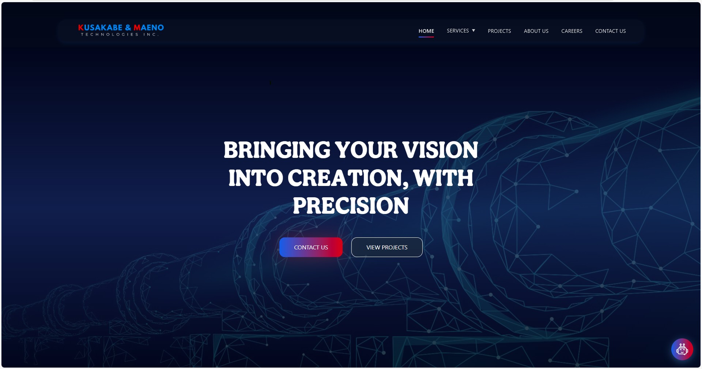
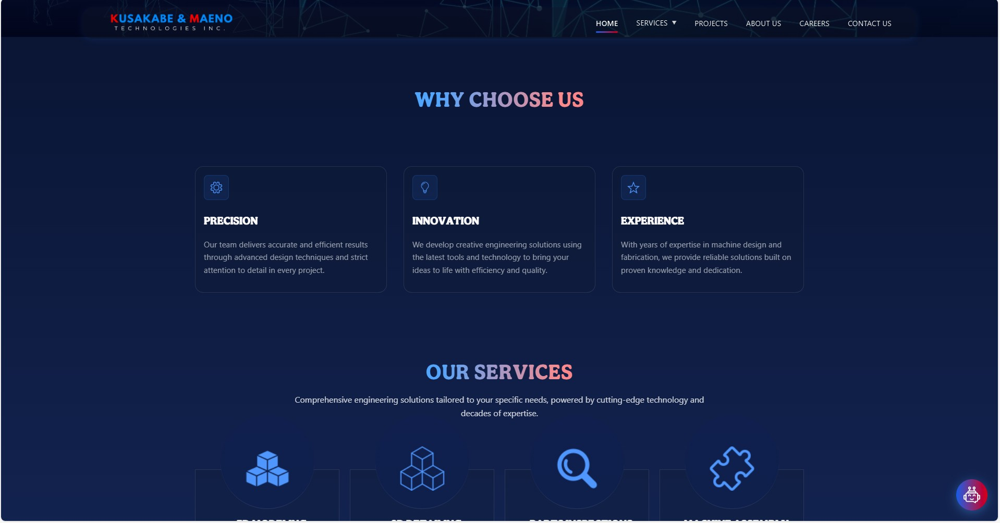
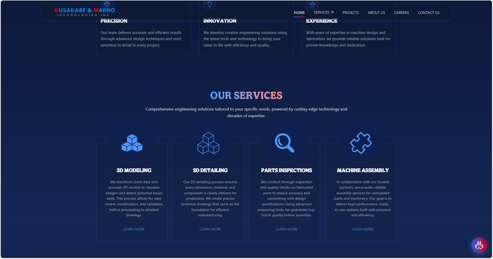
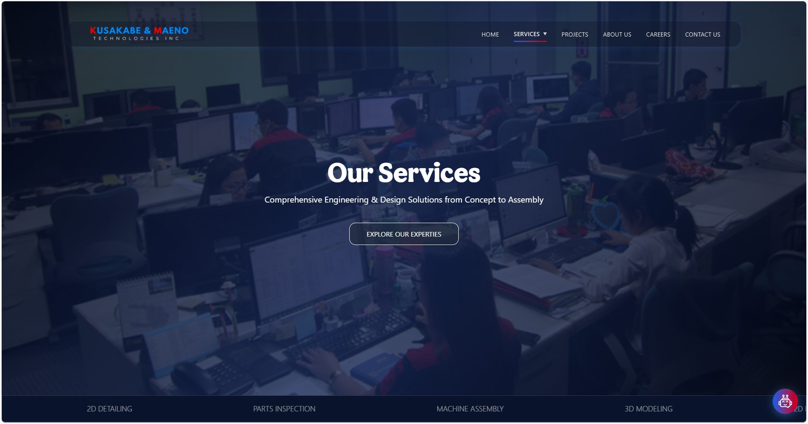
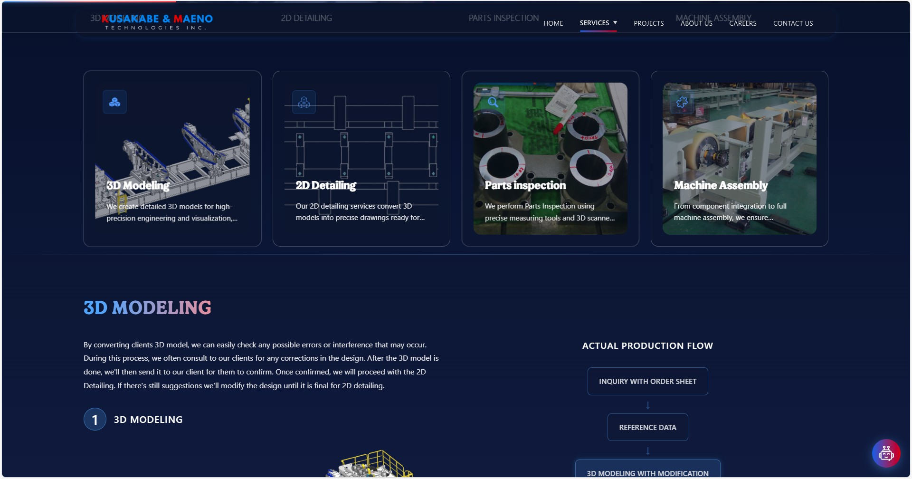
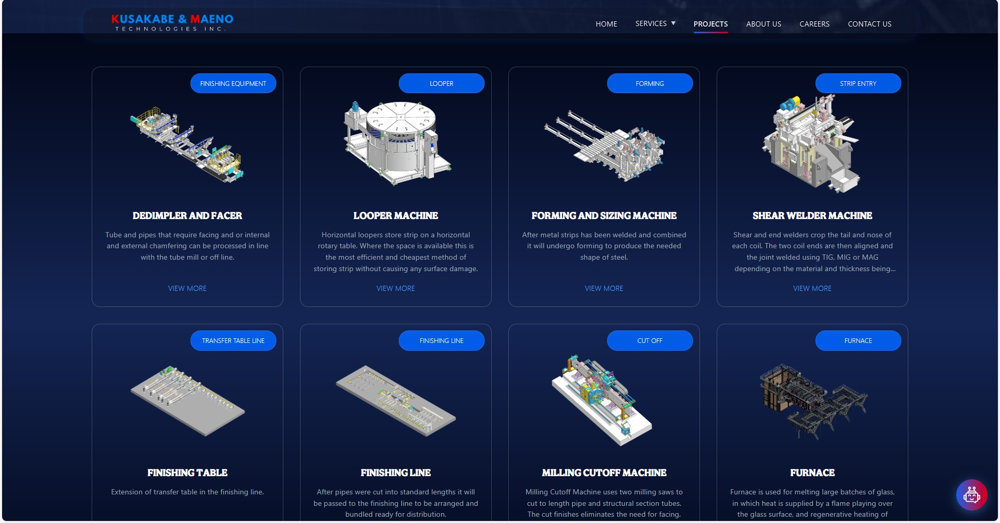
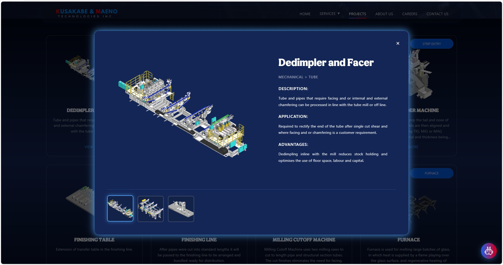
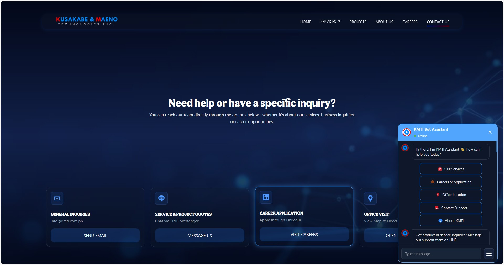

# KMTI Company Website

A modern, interactive company website built with React and TypeScript, featuring an AI-powered chatbot, dynamic project showcases, and comprehensive service presentations. This project demonstrates professional web development practices with a focus on user experience, responsive design, and interactive components.

## 📋 Overview

This is the official website for KMTI (Kusakabe & Maeno Tech Inc.), showcasing the company's engineering services, project portfolio, team information, and career opportunities. The website provides an engaging user experience through interactive ellements, smooth animations, and an intelligent chatbot assistant.

## ✨ Features

### 🤖 AI Chatbot Assistant
- **Interactive FAQ System**: AI-powered chatbot that answers common questions about services, careers, and company information
- **Contextual Navigation**: Chatbot can navigate users to specific pages and sections
- **Action Buttons**: Direct links to LINE Messenger, Facebook, LinkedIn, email, and Google Maps
- **Conversation Flow**: Multi-step conversation system with typing indicators and message history
- **Reset Functionality**: Ability to restart conversations and reset chatbot state

### 🎨 Interactive UI Components

#### Homepage
- **Hero Section**: Full-screen hero with gradient overlay and call-to-action buttons
- **Why Choose Us Section**: Feature cards highlighting company strengths (Precision, Innovation, Experience)
- **Service Cards**: Interactive cards linking to detailed service pages
- **Project Carousel**: Auto-rotating carousel showcasing featured projects with smooth transitions
- **Smooth Scrolling**: Seamless navigation between sections

#### Services Page
- **Service Grid**: Visual grid displaying all four main services (3D Modeling, 2D Detailing, Parts Inspection, Machine Assembly)
- **Detailed Service Sections**: In-depth information for each service with:
  - Interactive image carousels with manual controls
  - Zoom and pan functionality for 2D detail images
  - Production flow visualization with clickable steps
  - Step-by-step process indicators
- **Scroll Progress Indicator**: Visual progress bar showing page scroll position
- **Interactive Navigation Tabs**: Clickable service navigation with active state tracking
- **Fade-in Animations**: Smooth section animations on scroll

#### Projects Page
- **Project Gallery**: Grid layout showcasing all company projects
- **Project Modals**: Detailed modal views for each project featuring:
  - High-resolution project images
  - Detailed descriptions and specifications
  - Category tags and metadata
  - Smooth open/close animations
- **URL-based Modal Opening**: Direct links to specific project modals via URL parameters
- **Image Galleries**: Multiple images per project with navigation controls

#### About Us Page
- **Company Story**: Narrative section about company history and values
- **Management Team**: Interactive team member cards with photos and roles
- **Vision & Mission**: Visual cards displaying company vision and mission statements
- **Related Companies**: Showcase of partner companies and collaborations
- **Modal System**: Expandable "Our Story" modal with detailed company information

#### Careers Page
- **Job Listings**: Grid layout displaying available positions
- **Application Process**: Step-by-step guide for applicants
- **Benefits Section**: Comprehensive benefits information
- **Apply Now Functionality**: Direct links to application portals

#### Contact Page
- **Contact Options**: Multiple contact methods (Email, LINE Messenger, LinkedIn, Google Maps)
- **Chatbot Integration**: Direct access to AI assistant from contact page
- **Social Media Links**: Quick access to company social media profiles
- **Interactive Cards**: Clickable contact option cards with hover effects

### 🎭 Animations & Interactions

- **AOS (Animate On Scroll)**: Scroll-triggered animations throughout the site
- **Hover Effects**: Interactive hover states on cards, buttons, and navigation elements
- **Smooth Transitions**: CSS transitions for all interactive elements
- **Loading States**: Visual feedback during content loading
- **Micro-interactions**: Subtle animations enhancing user experience

### 📱 Responsive Design

- **Mobile-First Approach**: Fully responsive layout for all screen sizes
- **Breakpoint Optimization**: Custom breakpoints for tablets, mobile, and desktop
- **Touch-Friendly**: Optimized for touch interactions on mobile devices
- **Hamburger Menu**: Collapsible navigation menu for mobile devices
- **Adaptive Grids**: Grid layouts that adapt to screen size

### 🧭 Navigation Features

- **React Router**: Client-side routing with smooth page transitions
- **Scroll-to-Top**: Automatic scroll to top on route changes
- **Active Link Highlighting**: Visual indication of current page
- **Dropdown Menus**: Accessible dropdown navigation for Services section
- **Hash Navigation**: Direct links to specific page sections
- **URL Query Parameters**: Support for opening modals via URL parameters

### 🎯 Additional Features

- **Text Selection Prevention**: Custom utility to prevent unwanted text selection
- **Accessibility**: ARIA labels, keyboard navigation support, and semantic HTML
- **Performance Optimized**: Efficient rendering and minimal re-renders
- **Type Safety**: Full TypeScript implementation for type safety
- **Component Reusability**: Modular component architecture

## 🛠️ Tech Stack

### Core Technologies
- **React 19.1.1**: Modern React with latest features
- **TypeScript 5.9.3**: Type-safe JavaScript for better development experience
- **Vite 7.1.7**: Fast build tool and development server
- **React Router DOM 7.9.5**: Client-side routing and navigation

### Libraries & Tools
- **AOS (Animate On Scroll) 2.3.4**: Scroll-triggered animations
- **ESLint**: Code linting and quality assurance
- **Prettier**: Code formatting
- **TypeScript ESLint**: TypeScript-specific linting rules

### Styling
- **Vanilla CSS**: Custom CSS with CSS variables for theming
- **CSS Modules**: Scoped styling per component
- **Responsive Design**: Media queries and flexible layouts
- **CSS Animations**: Custom keyframe animations and transitions

### Assets
- **Images**: PNG/JPG images for projects, services, and team members
- **3D Models**: GLB format 3D model files (sample.glb)
- **Icons**: Custom icon set for UI elements

## 📁 Project Structure

```
kmti-website/
├── src/
│   ├── assets/              # Images, icons, and 3D models
│   │   ├── 3DMODELS/        # 3D model files
│   │   ├── aboutPage/       # About page assets
│   │   ├── icons/           # Icon set
│   │   ├── image3D/          # 3D project images
│   │   ├── management/       # Team member photos
│   │   ├── modalImage/       # Modal gallery images
│   │   └── servicePage/      # Service page assets
│   ├── components/
│   │   ├── common/           # Shared components
│   │   │   ├── ChatbotButton/    # Chatbot trigger button
│   │   │   ├── Footer/           # Site footer
│   │   │   ├── Layout/           # Main layout wrapper
│   │   │   ├── Navbar/           # Navigation bar
│   │   │   └── ScrollToTop/      # Scroll to top component
│   │   └── ui/               # UI components
│   │       ├── Button/           # Reusable button component
│   │       ├── Card/             # Card components (Service, Project, etc.)
│   │       ├── Input/            # Form input component
│   │       ├── Modal/            # Modal dialog component
│   │       ├── NavDropdown/      # Navigation dropdown
│   │       └── ProjectCarousel/  # Project carousel component
│   ├── pages/                # Page components
│   │   ├── About/            # About Us page
│   │   ├── Careers/          # Careers page
│   │   ├── Contact/          # Contact page
│   │   ├── Home/             # Homepage
│   │   ├── Projects/         # Projects showcase page
│   │   └── Services/         # Services page
│   ├── styles/               # Global styles
│   │   ├── globals.css       # Global CSS rules
│   │   ├── reset.css         # CSS reset
│   │   └── variables.css     # CSS custom properties
│   ├── utils/                # Utility functions
│   │   └── preventTextSelection.ts
│   ├── App.tsx               # Main app component
│   └── main.tsx              # Application entry point
├── public/                   # Static public assets
├── package.json              # Dependencies and scripts
└── README.md                 # This file
```

## 🚀 Installation & Setup

### Prerequisites
- **Node.js**: Version 18 or higher
- **npm** or **yarn**: Package manager

### Installation Steps

1. **Clone the repository**
   ```bash
   git clone <repository-url>
   cd kmti-website
   ```

2. **Install dependencies**
   ```bash
   npm install
   ```
   or
   ```bash
   yarn install
   ```

3. **Start the development server**
   ```bash
   npm run dev
   ```
   or
   ```bash
   yarn dev
   ```

4. **Open in browser**
   - The development server will start on `http://localhost:5173` (or the next available port)
   - Open this URL in your web browser

### Build for Production

```bash
npm run build
```

This creates an optimized production build in the `dist/` directory.

### Preview Production Build

```bash
npm run preview
```

### Additional Commands

- **Lint code**: `npm run lint`
- **Format code**: `npm run format`

## 💡 Usage Guide

### Chatbot Interaction

1. **Opening the Chatbot**: Click the chatbot button (usually in the bottom-right corner)
2. **Starting a Conversation**: The chatbot greets you with initial options
3. **Navigation**: Click buttons to navigate to different topics or pages
4. **External Links**: Use action buttons to open LINE, Facebook, LinkedIn, or Maps
5. **Resetting**: Click "Back" or close/reopen the chatbot to restart

### Navigating Projects

1. **Viewing Projects**: Navigate to the Projects page from the main menu
2. **Opening Project Details**: Click any project card to open its detailed modal
3. **Direct Links**: Projects can be accessed directly via URL: `/projects?project=project-name`
4. **Closing Modals**: Click outside the modal or use the close button

### Exploring Services

1. **Service Overview**: Visit the Services page to see all available services
2. **Service Details**: Click on a service card to scroll to its detailed section
3. **Interactive Elements**:
   - Use carousel dots to navigate through service images
   - Zoom and pan 2D detail images by hovering and using mouse wheel
   - Click production flow steps to navigate between related services
4. **Navigation Tabs**: Use the scrolling service tabs to jump to specific services

### Using Navigation

1. **Main Menu**: Use the top navigation bar to access all pages
2. **Services Dropdown**: Hover over "SERVICES" to see service subcategories
3. **Mobile Menu**: On mobile devices, use the hamburger menu icon
4. **Logo Click**: Click the logo to return to the homepage

## 📸 Screenshots

### Homepage
<!-- Add screenshot: Homepage hero section with call-to-action buttons -->


<!-- Add screenshot: Why Choose Us section with feature cards -->


<!-- Add screenshot: Service cards and project carousel -->


### Services Page
<!-- Add screenshot: Services grid layout -->


<!-- Add screenshot: Detailed service section with carousel -->


### Projects Page
<!-- Add screenshot: Project gallery grid -->


<!-- Add screenshot: Project modal with details -->


### Chatbot
<!-- Add screenshot: Chatbot interface with conversation -->


## 🎯 Key Highlights

- **Modern React Architecture**: Built with React 19 and TypeScript for type safety
- **Performance Optimized**: Fast load times and smooth animations
- **Accessibility Focused**: ARIA labels, keyboard navigation, and semantic HTML
- **Responsive Design**: Seamless experience across all devices
- **Interactive Components**: Engaging UI with hover effects, animations, and transitions
- **Component-Based**: Reusable, modular components for maintainability
- **Clean Code**: Well-organized structure following best practices

## 📝 Development Notes

- The project uses CSS custom properties (variables) for consistent theming
- All components are TypeScript-typed for better development experience
- The chatbot uses a state machine pattern for conversation flow
- Modals are controlled via React state and URL parameters
- Scroll animations are handled by AOS library
- Text selection is prevented by default (can be enabled for interactive elements)

## 🔧 Customization

### Changing Colors
Edit `src/styles/variables.css` to modify the color scheme and CSS variables.

### Adding New Pages
1. Create a new folder in `src/pages/`
2. Add the route in `src/App.tsx`
3. Add navigation link in `src/components/common/Navbar/Navbar.tsx`

### Modifying Chatbot
Edit `src/components/ui/Card/chatbot.tsx` to modify chatbot behavior and responses.

## 📄 License

This project is proprietary and confidential.

## 👤 Developer

This website was developed as a company project, showcasing modern web development practices and user experience design.

---

**Built with ❤️ using React, TypeScript, and Vite**
