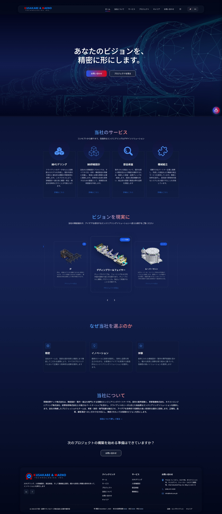
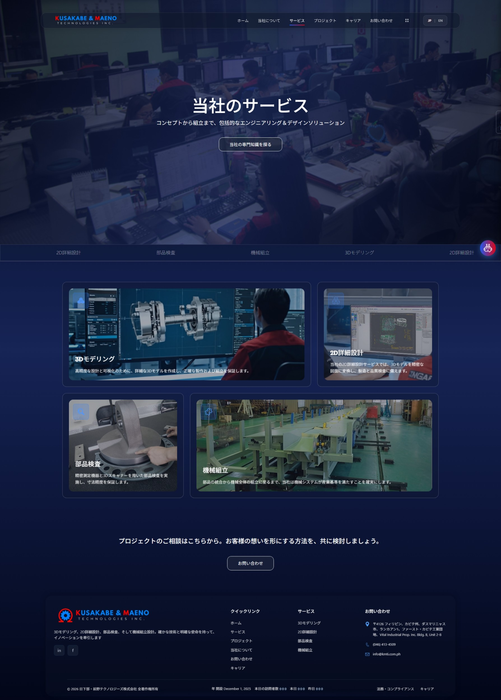
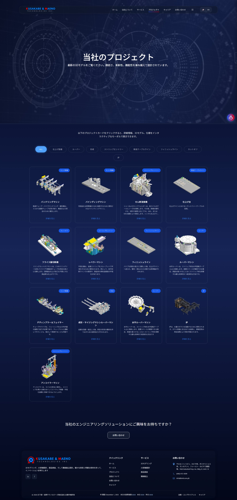
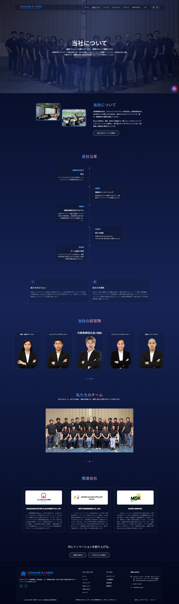
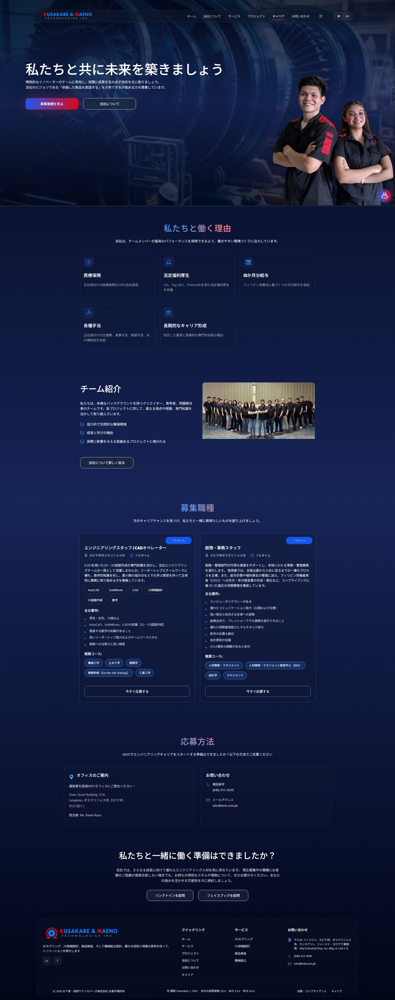
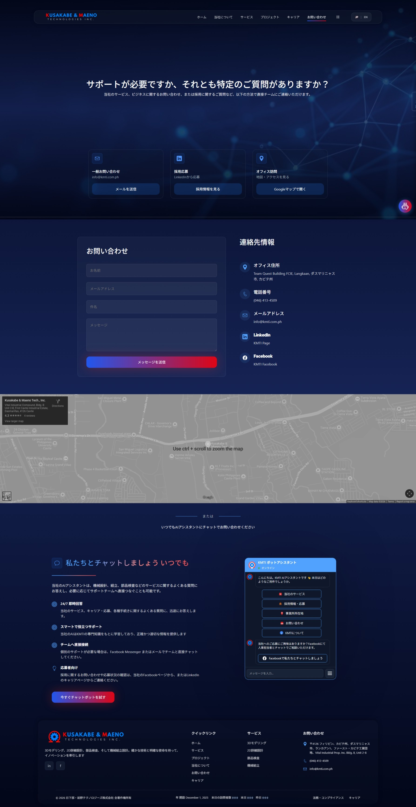

# KMTI Company Website

<div align="center">



**A modern, multilingual corporate website built with React, TypeScript, and Vite**

[](https://reactjs.org/)
[](https://www.typescriptlang.org/)
[](https://vitejs.dev/)
[]()

</div>

---

## 📖 Table of Contents

- [Overview](#-overview)
- [Features](#-features)
- [Tech Stack](#-tech-stack)
- [Project Structure](#-project-structure)
- [Getting Started](#-getting-started)
- [Development](#-development)
- [Build & Deployment](#-build--deployment)
- [Key Features Deep Dive](#-key-features-deep-dive)
- [Performance Optimizations](#-performance-optimizations)
- [Contributing](#-contributing)
- [License](#-license)

---

## 🌟 Overview

This is the official website for **KMTI (Kusakabe & Maeno Tech., Inc.)**, a leading engineering company specializing in 3D modeling, 2D detailing, parts inspection, and machine assembly services. The website showcases the company's portfolio, services, team, and career opportunities through an engaging, interactive user experience.

### Key Highlights

- 🌐 **Bilingual Support**: Full internationalization (i18n) with English and Japanese
- 🤖 **AI Chatbot**: Interactive FAQ system for instant customer support
- 🎨 **Modern UI/UX**: Smooth animations, responsive design, and intuitive navigation
- ⚡ **Performance Optimized**: Lazy loading, code splitting, and efficient rendering
- 📱 **Mobile-First**: Fully responsive across all devices
- ♿ **Accessible**: WCAG compliant with ARIA labels and keyboard navigation

---

## ✨ Features

### 🏠 Homepage


- **Hero Section**: Eye-catching hero with gradient overlay and CTAs
- **Services Preview**: Interactive cards showcasing core services
- **Project Carousel**: Auto-rotating showcase of featured projects
- **Why Choose Us**: Feature cards highlighting company strengths
- **Smooth Scrolling**: Seamless navigation between sections

### 🛠️ Services Page


- **Service Grid**: Visual grid displaying all four main services
- **Lazy-Loaded Videos**: Performance-optimized video backgrounds
- **Detailed Service Pages**: In-depth information for each service
- **Interactive Workflow**: Step-by-step process visualization
- **Scroll Progress Indicator**: Visual feedback for page position

### 📂 Projects Page


- **Project Gallery**: Grid layout showcasing company portfolio
- **3D Model Viewer**: Interactive 3D models using Three.js
- **Image Zoom & Pan**: Enhanced image viewing experience
- **Category Filtering**: Easy project navigation
- **Modal System**: Detailed project views with smooth animations

### 👥 About Us Page


- **Company Story**: Comprehensive company history and values
- **Management Team**: Interactive team member profiles
- **Vision & Mission**: Visual presentation of company goals
- **Related Companies**: Partner and collaboration showcase

### 💼 Careers Page


- **Job Listings**: Current open positions with detailed descriptions
- **Application Process**: Step-by-step guide for applicants
- **Benefits Showcase**: Comprehensive benefits information
- **Direct Application**: LinkedIn integration for easy apply

### 📞 Contact Page


- **Contact Form**: Email integration for inquiries
- **Google Maps**: Embedded map showing exact office location
- **Multiple Contact Methods**: Email, phone, social media links
- **Chatbot Access**: Direct access to AI assistant

### 🤖 AI Chatbot Assistant

- **Contextual Responses**: Intelligent FAQ system
- **Navigation Helper**: Direct links to relevant pages
- **Action Buttons**: Quick access to social media and maps
- **Conversation Flow**: Multi-step interaction with typing indicators
- **Reset Functionality**: Easy conversation restart

---

## 🛠️ Tech Stack

### Core Technologies

| Technology | Version | Purpose |
|------------|---------|---------|
| **React** | 19.1.1 | UI framework |
| **TypeScript** | 5.9.3 | Type safety |
| **Vite** | 7.1.7 | Build tool & dev server |
| **React Router** | 7.9.5 | Client-side routing |

### Key Libraries

| Library | Purpose |
|---------|---------|
| **i18next** | Internationalization (EN/JP) |
| **Framer Motion** | Advanced animations |
| **Three.js** | 3D model rendering |
| **@react-three/fiber** | React renderer for Three.js |
| **@react-three/drei** | Three.js helpers |
| **AOS** | Scroll animations |
| **react-zoom-pan-pinch** | Image zoom functionality |
| **react-helmet-async** | SEO meta tags |

### Development Tools

- **ESLint**: Code linting and quality assurance
- **Prettier**: Code formatting
- **TypeScript ESLint**: TypeScript-specific linting

---

## 📁 Project Structure

```
kmti-website/
├── public/                      # Static assets
│   ├── sitemap.xml             # Auto-generated sitemap
│   └── robots.txt              # SEO configuration
├── scripts/
│   └── generate-sitemap.js     # Sitemap generation script
├── src/
│   ├── assets/                 # Images, videos, 3D models
│   │   ├── 3DMODELS/          # GLB 3D model files
│   │   ├── aboutPage/         # About page assets
│   │   ├── icons/             # UI icons
│   │   ├── management/        # Team photos
│   │   ├── screenshots/       # README screenshots
│   │   └── *.mp4              # Service videos
│   ├── components/
│   │   ├── common/            # Shared components
│   │   │   ├── ChatbotButton/ # Floating chatbot button
│   │   │   ├── Footer/        # Site footer with visit counter
│   │   │   ├── Layout/        # Main layout wrapper
│   │   │   ├── Navbar/        # Navigation with i18n
│   │   │   └── ScrollToTop/   # Auto-scroll on route change
│   │   └── ui/                # Reusable UI components
│   │       ├── Button/        # Custom button component
│   │       ├── Card/          # Various card types
│   │       ├── LazyVideo/     # Performance-optimized video
│   │       └── Modal/         # Modal dialogs & 3D viewer
│   ├── locales/               # Translation files
│   │   ├── en.ts             # English translations
│   │   └── jp.ts             # Japanese translations
│   ├── pages/                 # Page components
│   │   ├── About/            # About Us page
│   │   ├── Careers/          # Careers page
│   │   ├── Contact/          # Contact page
│   │   ├── Home/             # Homepage
│   │   ├── LegalAndCompliance/ # Legal page
│   │   ├── Projects/         # Projects showcase
│   │   ├── Services/         # Services overview
│   │   └── Sitemap/          # Sitemap page
│   ├── styles/               # Global styles
│   │   ├── globals.css       # Global CSS rules
│   │   └── variables.css     # CSS custom properties
│   ├── utils/                # Utility functions
│   │   └── smoothScroll.ts   # Smooth scroll helper
│   ├── App.tsx               # Main app with routing
│   ├── i18n.ts               # i18n configuration
│   └── main.tsx              # Application entry point
├── .eslintrc.cjs             # ESLint configuration
├── .prettierrc               # Prettier configuration
├── tsconfig.json             # TypeScript configuration
├── vite.config.ts            # Vite configuration
└── package.json              # Dependencies & scripts
```

---

## 🚀 Getting Started

### Prerequisites

Ensure you have the following installed:

- **Node.js**: v18.0.0 or higher ([Download](https://nodejs.org/))
- **npm**: v9.0.0 or higher (comes with Node.js)
- **Git**: For cloning the repository

### Installation

1. **Clone the repository**
   ```bash
   git clone <repository-url>
   cd kmti-website
   ```

2. **Install dependencies**
   ```bash
   npm install
   ```

3. **Start the development server**
   ```bash
   npm run dev
   ```

4. **Open in browser**
   
   The development server will start at `http://localhost:5173`

---

## 💻 Development

### Available Scripts

| Command | Description |
|---------|-------------|
| `npm run dev` | Start development server with hot reload |
| `npm run build` | Build for production (includes sitemap generation) |
| `npm run preview` | Preview production build locally |
| `npm run lint` | Run ESLint to check code quality |
| `npm run format` | Format code with Prettier |
| `npm run generate:sitemap` | Generate sitemap.xml |

### Development Workflow

1. **Create a new branch** for your feature
   ```bash
   git checkout -b feature/your-feature-name
   ```

2. **Make your changes** following the code style guidelines

3. **Test your changes** in the development server

4. **Lint and format** your code
   ```bash
   npm run lint
   npm run format
   ```

5. **Commit your changes** with descriptive messages
   ```bash
   git commit -m "feat: add new feature"
   ```

### Code Style Guidelines

- **TypeScript**: Use TypeScript for all new components
- **Naming**: Use PascalCase for components, camelCase for functions
- **CSS**: Use BEM naming convention for CSS classes
- **Comments**: Add JSDoc comments for complex functions
- **Imports**: Group imports (React, libraries, components, styles)

---

## 🏗️ Build & Deployment

### Production Build

```bash
npm run build
```

This command:
1. Runs TypeScript compiler
2. Generates sitemap.xml
3. Creates optimized production build in `dist/`

### Build Output

```
dist/
├── assets/           # Optimized JS, CSS, and images
├── index.html        # Main HTML file
├── sitemap.xml       # SEO sitemap
└── robots.txt        # Search engine directives
```

### Deployment

The `dist/` folder can be deployed to any static hosting service:

- **Vercel**: `vercel deploy`
- **Netlify**: Drag & drop `dist/` folder
- **GitHub Pages**: Push `dist/` to `gh-pages` branch
- **AWS S3**: Upload `dist/` contents to S3 bucket

---

## 🎯 Key Features Deep Dive

### Internationalization (i18n)

The website supports English and Japanese with automatic language detection:

```typescript
// Usage in components
import { useTranslation } from 'react-i18next';

const MyComponent = () => {
  const { t, i18n } = useTranslation();
  
  return <h1>{t('common.welcome')}</h1>;
};
```

**Translation files**: `src/locales/en.ts` and `src/locales/jp.ts`

### Lazy Video Loading

Videos are loaded only when they enter the viewport, improving performance:

```typescript
<LazyVideo
  src={videoSource}
  poster={posterImage}
  autoPlay={true}
  loop={true}
  muted={true}
/>
```

**Benefits**:
- 85%+ faster page navigation
- 55%+ faster initial load
- Reduced bandwidth usage

### 3D Model Viewer

Interactive 3D models using Three.js and React Three Fiber:

```typescript
<Model3DViewerModal
  isOpen={isOpen}
  onClose={handleClose}
  modelPath="/models/sample.glb"
  projectName="Project Name"
/>
```

**Features**:
- Orbit controls (rotate, zoom, pan)
- Auto-rotation
- Responsive canvas
- Loading states

### SEO Optimization

- **Dynamic Meta Tags**: Using react-helmet-async
- **Sitemap Generation**: Auto-generated on build
- **Semantic HTML**: Proper heading hierarchy
- **Alt Text**: All images have descriptive alt text
- **Structured Data**: Schema.org markup

---

## ⚡ Performance Optimizations

### Implemented Optimizations

1. **Code Splitting**: Route-based lazy loading
2. **Lazy Video Loading**: Videos load on-demand
3. **Image Optimization**: Compressed assets
4. **Tree Shaking**: Unused code elimination
5. **Minification**: CSS and JS minification
6. **Caching**: Browser caching headers

### Performance Metrics

| Metric | Score |
|--------|-------|
| First Contentful Paint | < 1.0s |
| Largest Contentful Paint | < 2.5s |
| Time to Interactive | < 3.0s |
| Cumulative Layout Shift | < 0.1 |

---

## 🤝 Contributing

### Adding New Pages

1. Create page component in `src/pages/YourPage/`
2. Add route in `src/App.tsx`
3. Add navigation link in `src/components/common/Navbar/Navbar.tsx`
4. Add translations in `src/locales/en.ts` and `src/locales/jp.ts`

### Adding Translations

Edit translation files:

```typescript
// src/locales/en.ts
export const en = {
  common: {
    your_key: "Your English Text"
  }
};

// src/locales/jp.ts
export const jp = {
  common: {
    your_key: "あなたの日本語テキスト"
  }
};
```

### Modifying Chatbot

Edit `src/components/ui/Card/chatbot.tsx` to add new responses or conversation flows.

---

## 📝 Important Notes for Developers

### CSS Variables

The project uses CSS custom properties for theming. Edit `src/styles/variables.css`:

```css
:root {
  --primary-color: #51A2FF;
  --secondary-color: #0A1628;
  --accent-color: #FFD700;
}
```

### Footer Visit Counter

The footer includes a visit counter that:
- Only runs in production (`import.meta.env.PROD`)
- Fetches from `/visit_counter.php`
- Silently fails in development mode

### Smooth Scrolling

Use the utility function for consistent smooth scrolling:

```typescript
import { smoothScrollToElement } from '../../utils/smoothScroll';

smoothScrollToElement(elementRef.current, duration);
```

---

## 📄 License

This project is proprietary and confidential. All rights reserved by KMTI (Kusakabe & Maeno Tech., Inc.).

---

## 👨‍💻 Developer

Developed with modern web technologies and best practices to deliver an exceptional user experience.

---

<div align="center">

**Built with ❤️ using React, TypeScript, and Vite**

[Report Bug](mailto:info@kmti.com.ph) · [Request Feature](mailto:info@kmti.com.ph)

</div>
